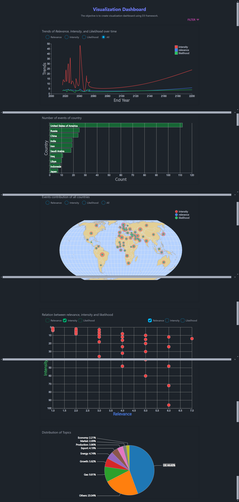

# Visualization Dashboard

- I am making Visualization dashboard along with d3 framework.

## Table of Contents

- [Features](#features)
- [Installation](#installation)
- [Folder Structure](#folder-structure)
- [Technology](#technologies-used)
- [Contact](#contact)

## Links

- [github link](https://github.com/nkp1111/visualization-dashboard)
- [live server link]()

## Features

- Mongo db for database
- D3 framework for visualization
- React for frontend
- Made line-chart, bar graph, world map, scatter plot and pie chart to show various relation between data.

### Screenshot



## Installation

Instructions on how to install and set up your project locally.

```bash
# Clone the repository
git clone https://github.com/nkp1111/visualization-dashboard.git

# Navigate to the project directory
cd visualization-dashboard

# Install backend dependencies
cd backend
npm install

# Install frontend dependencies
cd ../frontend
npm install

# Run the backend development server
cd ../backend
npm run dev

# Run the frontend development server
cd ../frontend
npm run dev
```

## Folder Structure

```
visualization-dashboard/
├── backend/
│   ├── controllers/
│   ├── constant/
│   ├── routes/
│   ├── config/
│   ├── middleware/
│   └── index.js
├── frontend/
│   ├── src/
│   │   ├── components/
│   │   ├── constant/
│   │   ├── services/
│   │   ├── lib/
│   │   ├── main.jsx
│   │   └── App.jsx
│   └── public/
└── README.md

```

## Technologies Used

- Backend: mongodb, express, cors, dotenv, http-status-codes
- Frontend: react, d3, tailwind, daisyui, topojson-client, world-countries

## Contact

- Neeraj Parmar
- GitHub [nkp1111](https://github.com/nkp1111)
- LinkedIn [neeraj](https://www.linkedin.com/in/neeraj-parmar-058591244/)
- Twitter [@nkp11111507](https://twitter.com/@nkp11111507)
